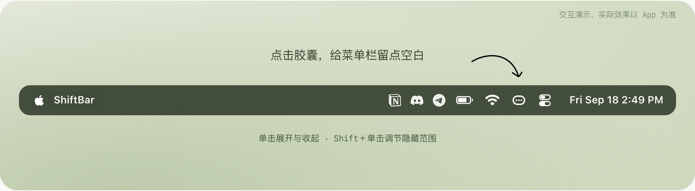

# ShiftBar

[English](README.md) | **简体中文**

ShiftBar **面向 macOS 27**，是对系统原生菜单栏折叠功能的补充工具，让你可以主动设置隐藏范围，并手动展开或收起图标。

macOS 27 会在菜单栏空间不足时自动折叠图标，但即使空间仍然充足，你也可能希望收起一些不常使用的项目。ShiftBar 通过调整菜单栏的可用空间，提前触发系统原生折叠，让你不必等到图标挤满菜单栏后才使用这一功能。

折叠仍由 macOS 的原生布局处理。ShiftBar 提供范围调节、展开与收起，以及配置保存。

  

<em>ShiftBar 功能展示，实际效果以 App 为准。</em>

## 功能

- **手动展开与收起**：单击菜单栏中的胶囊图标，在两种状态之间切换。
- **调整隐藏范围**：直接在菜单栏拖动调节条，选择左侧图标的隐藏范围。
- **隐藏左侧全部图标**：通过右键菜单一次设置。
- **保存与恢复备份**：主动保存一份隐藏范围，后续调节不会覆盖它；需要时从菜单恢复。
- **记住配置**：重新打开 App 后尝试恢复上次完成的隐藏范围。
- **多屏一致**：内置屏和外接显示器保持同一折叠结果。
- **登录时启动**：从右键菜单开启或关闭系统登录项。
- **三种界面语言**：支持简体中文、英文和日语，跟随 macOS 的语言偏好。

ShiftBar 常驻菜单栏，不显示 Dock 图标。隐藏图标不会关闭对应的应用。

## 安装

从本仓库的 [Releases](https://github.com/Superoutman/ShiftBar/releases/latest) 页面下载 `.dmg` 安装包，将 **ShiftBar.app** 移入 **应用程序** 文件夹后打开。

**面向 macOS 27**，需要 Apple Silicon（M 系列芯片）。目前处于 Alpha 阶段。

[官网](https://shiftbar.0x01.build) · [下载](https://github.com/Superoutman/ShiftBar/releases) · [问题反馈](https://github.com/Superoutman/ShiftBar/issues)

## 使用

首次使用时，需要在 **系统设置 → 隐私与安全性 → 辅助功能** 中允许 ShiftBar，以读取菜单栏位置并处理调节操作。

首次授权说明可选择「稍后设置」；之后右键点击菜单栏胶囊，选择「打开辅助功能设置…」即可继续授权。授权完成后自动检测，无需重启。首次没有位置记忆时胶囊默认靠右，首次授权后会显示一次位置引导。

1. **Shift＋单击**胶囊图标，进入隐藏范围调节。
2. 等待调节条准备完成，按住 **Shift** 拖动：向左增加隐藏范围，向右缩小。
3. 单击胶囊图标，确认并保存范围。

设置完成后，普通单击即可展开隐藏图标，再次单击恢复收起。

右键菜单提供调整范围、隐藏左侧全部图标、保存／恢复隐藏区域和使用说明。菜单底部的版本号用于检查更新，“关于”用于打开产品页面。

## 使用说明

- 可调范围受屏幕空间、刘海区域和当前菜单栏布局影响，达到上限时会显示提示。
- 如果权限不可用或布局暂时无法确认，ShiftBar 会先展开图标，保留上次保存的范围与备份。
- **已知问题**：Synology Drive 暂不兼容当前多屏隐藏机制。折叠时，其图标可能随隐藏组消失，即使它位于希望保留的区域；展开 ShiftBar 后会恢复显示。
- 隐藏范围和备份保存在本机，整理功能无需注册账号，可离线使用。
- 界面按 macOS 的首选语言顺序选择，也支持系统中的 App 专用语言。没有匹配的语言时回退英文；其他中文变体使用简体中文。更改语言后重新打开 App 生效。

## 问题反馈

请通过本仓库的 [Issues](https://github.com/Superoutman/ShiftBar/issues) 提交问题或建议。反馈显示、折叠或调节问题时，请提供 macOS 版本、ShiftBar 版本、显示器使用情况及复现步骤；必要时附上截图或短录屏。
